# msxbios-tools

## Example output

```sh
java -jar ./target/msxbiostools.jar view ./bios/reference/Canon_V_20.rom
```

```
crc32: e9ccd789
msx: MSX 1
fixes: does not have SLOTFIX, has NDEVFIX
country: UK keyboard, Int BASIC, Int charset, D-M-Y
font: CGTABL at 1bbf, International font
frequency: 50Hz
SCNCNT: Every 3 frame(s) (repetition: 13/1)
delay: 6
screen: SCREEN 0 (INITXT), WIDTH 37, COLOR ,,4
```

## Example TSV output

```sh
java -jar ./target/msxbiostools.jar tsv ./bios/reference
```

| Filename	            | crc32		| MSX version	| frequency	| BASIC version	| Keyboard type	| Date format	| Character set	| CGTABL			| System font				| Keyboard scan and repeat count		| Initial delay	| SCREEN			| WIDTH		| BDRCLR	| Has NDEVFIX?			| Has SLOTFIX?			|
|-----------------------|-----------|:-------------:|:---------:|---------------|---------------|:-------------:|---------------|-------------------|---------------------------|---------------------------------------|:-------------:|-------------------|-----------|-----------|-----------------------|-----------------------|
| Canon_V_20			| e9ccd789	| MSX 1			| 50Hz		| Int BASIC		| UK keyboard	| D-M-Y			| Int charset	| CGTABL at 1bbf	| International font		| Every 3 frame(s) (repetition: 13/1)	| 6				| SCREEN 0 (INITXT)	| WIDTH 37	| COLOR ,,4	| has NDEVFIX			| does not have SLOTFIX	|
| Casio_MX_10			| ee229390	| MSX 1			| 60Hz		| Jap BASIC		| Jap keyboard	| Y-M-D			| Jap charset	| CGTABL at 1bbf	| Japanese font				| Every 3 frame(s) (repetition: 13/1)	| 6				| SCREEN 1 (INIT32)	| WIDTH 39	| COLOR ,,7	| does not have NDEVFIX	| does not have SLOTFIX	|
| Casio_MX_15			| 6481230f	| MSX 1			| 50Hz		| Int BASIC		| Int keyboard	| M-D-Y			| Int charset	| CGTABL at 1bbf	| International font		| Every 1 frame(s) (repetition: 39/3)	| 6				| SCREEN 0 (INITXT)	| WIDTH 37	| COLOR ,,4	| has NDEVFIX			| does not have SLOTFIX	|
| Casio_PV_16			| ee229390	| MSX 1			| 60Hz		| Jap BASIC		| Jap keyboard	| Y-M-D			| Jap charset	| CGTABL at 1bbf	| Japanese font				| Every 3 frame(s) (repetition: 13/1)	| 6				| SCREEN 1 (INIT32)	| WIDTH 39	| COLOR ,,7	| does not have NDEVFIX	| does not have SLOTFIX	|
| Casio_PV_7			| ee229390	| MSX 1			| 60Hz		| Jap BASIC		| Jap keyboard	| Y-M-D			| Jap charset	| CGTABL at 1bbf	| Japanese font				| Every 3 frame(s) (repetition: 13/1)	| 6				| SCREEN 1 (INIT32)	| WIDTH 39	| COLOR ,,7	| does not have NDEVFIX	| does not have SLOTFIX	|
| Casio_V_8				| e941b08e	| MSX 1			| 60Hz		| Jap BASIC		| Jap keyboard	| Y-M-D			| Jap charset	| CGTABL at 1bbf	| Japanese font				| Every 3 frame(s) (repetition: 13/1)	| 6				| SCREEN 1 (INIT32)	| WIDTH 39	| COLOR ,,7	| has NDEVFIX			| has SLOTFIX			|
| Daewoo_DPC_100		| 3ab0cd3b	| MSX 1			| 60Hz		| Jap BASIC		| Jap keyboard	| Y-M-D			| Jap charset	| CGTABL at 1b49	| Korean font				| Every 3 frame(s) (repetition: 13/1)	| 4				| SCREEN 1 (INIT32)	| WIDTH 39	| COLOR ,,7	| does not have NDEVFIX	| does not have SLOTFIX	|
| Daewoo_DPC_200		| 3ab0cd3b	| MSX 1			| 60Hz		| Jap BASIC		| Jap keyboard	| Y-M-D			| Jap charset	| CGTABL at 1b49	| Korean font				| Every 3 frame(s) (repetition: 13/1)	| 4				| SCREEN 1 (INIT32)	| WIDTH 39	| COLOR ,,7	| does not have NDEVFIX	| does not have SLOTFIX	|
| JVC_HC_7GB			| e9ccd789	| MSX 1			| 50Hz		| Int BASIC		| UK keyboard	| D-M-Y			| Int charset	| CGTABL at 1bbf	| International font		| Every 3 frame(s) (repetition: 13/1)	| 6				| SCREEN 0 (INITXT)	| WIDTH 37	| COLOR ,,4	| has NDEVFIX			| does not have SLOTFIX	|
| National_CF_2000		| ee229390	| MSX 1			| 60Hz		| Jap BASIC		| Jap keyboard	| Y-M-D			| Jap charset	| CGTABL at 1bbf	| Japanese font				| Every 3 frame(s) (repetition: 13/1)	| 6				| SCREEN 1 (INIT32)	| WIDTH 39	| COLOR ,,7	| does not have NDEVFIX	| does not have SLOTFIX	|
| National_CF_3000		| 5ad03407	| MSX 1			| 60Hz		| Jap BASIC		| Jap keyboard	| Y-M-D			| Jap charset	| CGTABL at 1bbf	| Japanese font				| Every 3 frame(s) (repetition: 13/1)	| 2				| SCREEN 1 (INIT32)	| WIDTH 39	| COLOR ,,7	| has NDEVFIX			| has SLOTFIX			|
| National_FS_4000		| 071135e0	| MSX 1			| 60Hz		| Jap BASIC		| Jap keyboard	| Y-M-D			| Jap charset	| CGTABL at 1bbf	| Japanese font				| Every 3 frame(s) (repetition: 13/1)	| 2				| SCREEN 1 (INIT32)	| WIDTH 39	| COLOR ,,7	| has NDEVFIX			| has SLOTFIX			|
| Philips_VG_8020_00	| 8205795e	| MSX 1			| 50Hz		| Int BASIC		| Int keyboard	| M-D-Y			| Int charset	| CGTABL at 1bbf	| International font		| Every 3 frame(s) (repetition: 13/1)	| 6				| SCREEN 0 (INITXT)	| WIDTH 37	| COLOR ,,4	| has NDEVFIX			| does not have SLOTFIX	|
| Sanyo_MPC100			| e9ccd789	| MSX 1			| 50Hz		| Int BASIC		| UK keyboard	| D-M-Y			| Int charset	| CGTABL at 1bbf	| International font		| Every 3 frame(s) (repetition: 13/1)	| 6				| SCREEN 0 (INITXT)	| WIDTH 37	| COLOR ,,4	| has NDEVFIX			| does not have SLOTFIX	|
| Sanyo_MPC2			| 3b08dc03	| MSX 1			| 60Hz		| Jap BASIC		| Jap keyboard	| Y-M-D			| Jap charset	| CGTABL at 1bbf	| Japanese font				| Every 3 frame(s) (repetition: 13/1)	| 6				| SCREEN 1 (INIT32)	| WIDTH 39	| COLOR ,,7	| has NDEVFIX			| has SLOTFIX			|
| Sanyo_PHC_28L			| d2110d66	| MSX 1			| 50Hz		| Int BASIC		| Fre keyboard	| D-M-Y			| Int charset	| CGTABL at 1bbf	| International font		| Every 3 frame(s) (repetition: 13/1)	| 6				| SCREEN 0 (INITXT)	| WIDTH 37	| COLOR ,,4	| has NDEVFIX			| does not have SLOTFIX	|
| Sanyo_PHC_28S			| e5cf6b3c	| MSX 1			| 50Hz		| Int BASIC		| UK keyboard	| D-M-Y			| Int charset	| CGTABL at 1bbf	| International font		| Every 3 frame(s) (repetition: 13/1)	| 6				| SCREEN 0 (INITXT)	| WIDTH 37	| COLOR ,,7	| has NDEVFIX			| does not have SLOTFIX	|
| Sony_HB75D			| 7e2b32dd	| MSX 1			| 50Hz		| Int BASIC		| Ger keyboard	| D-M-Y			| Int charset	| CGTABL at 1bbf	| International font (DIN)	| Every 3 frame(s) (repetition: 13/1)	| 6				| SCREEN 0 (INITXT)	| WIDTH 37	| COLOR ,,4	| has NDEVFIX			| does not have SLOTFIX	|
| Sony_HB_10			| ee229390	| MSX 1			| 60Hz		| Jap BASIC		| Jap keyboard	| Y-M-D			| Jap charset	| CGTABL at 1bbf	| Japanese font				| Every 3 frame(s) (repetition: 13/1)	| 6				| SCREEN 1 (INIT32)	| WIDTH 39	| COLOR ,,7	| does not have NDEVFIX	| does not have SLOTFIX	|
| Sony_HB_101P			| 0f488dd8	| MSX 1			| 50Hz		| Int BASIC		| UK keyboard	| D-M-Y			| Int charset	| CGTABL at 1bbf	| International font		| Every 1 frame(s) (repetition: 39/3)	| 6				| SCREEN 0 (INITXT)	| WIDTH 37	| COLOR ,,4	| has NDEVFIX			| does not have SLOTFIX	|
| Sony_HB_10P			| 0f488dd8	| MSX 1			| 50Hz		| Int BASIC		| UK keyboard	| D-M-Y			| Int charset	| CGTABL at 1bbf	| International font		| Every 1 frame(s) (repetition: 39/3)	| 6				| SCREEN 0 (INITXT)	| WIDTH 37	| COLOR ,,4	| has NDEVFIX			| does not have SLOTFIX	|
| Sony_HB_11			| 434f897b	| MSX 1			| 60Hz		| Jap BASIC		| Jap keyboard	| Y-M-D			| Jap charset	| CGTABL at 1bbf	| Japanese font				| Every 3 frame(s) (repetition: 13/1)	| 3				| SCREEN 1 (INIT32)	| WIDTH 39	| COLOR ,,7	| does not have NDEVFIX	| does not have SLOTFIX	|
| Sony_HB_201P			| 0f488dd8	| MSX 1			| 50Hz		| Int BASIC		| UK keyboard	| D-M-Y			| Int charset	| CGTABL at 1bbf	| International font		| Every 1 frame(s) (repetition: 39/3)	| 6				| SCREEN 0 (INITXT)	| WIDTH 37	| COLOR ,,4	| has NDEVFIX			| does not have SLOTFIX	|
| Sony_HB_20P			| 15ddeb5c	| MSX 1			| 50Hz		| Int BASIC		| Spa keyboard	| M-D-Y			| Int charset	| CGTABL at 1bbf	| International font		| Every 1 frame(s) (repetition: 39/3)	| 6				| SCREEN 0 (INITXT)	| WIDTH 37	| COLOR ,,4	| has NDEVFIX			| does not have SLOTFIX	|
| Sony_HB_501P			| 0f488dd8	| MSX 1			| 50Hz		| Int BASIC		| UK keyboard	| D-M-Y			| Int charset	| CGTABL at 1bbf	| International font		| Every 1 frame(s) (repetition: 39/3)	| 6				| SCREEN 0 (INITXT)	| WIDTH 37	| COLOR ,,4	| has NDEVFIX			| does not have SLOTFIX	|
| Sony_HB_55P			| e9ccd789	| MSX 1			| 50Hz		| Int BASIC		| UK keyboard	| D-M-Y			| Int charset	| CGTABL at 1bbf	| International font		| Every 3 frame(s) (repetition: 13/1)	| 6				| SCREEN 0 (INITXT)	| WIDTH 37	| COLOR ,,4	| has NDEVFIX			| does not have SLOTFIX	|
| Sony_HB_75P			| e9ccd789	| MSX 1			| 50Hz		| Int BASIC		| UK keyboard	| D-M-Y			| Int charset	| CGTABL at 1bbf	| International font		| Every 3 frame(s) (repetition: 13/1)	| 6				| SCREEN 0 (INITXT)	| WIDTH 37	| COLOR ,,4	| has NDEVFIX			| does not have SLOTFIX	|
| Spectravideo_SVI_728	| 1ce9246c	| MSX 1			| 60Hz		| Int BASIC		| Int keyboard	| M-D-Y			| Int charset	| CGTABL at 1bbf	| International font		| Every 3 frame(s) (repetition: 13/1)	| 6				| SCREEN 0 (INITXT)	| WIDTH 39	| COLOR ,,4	| has NDEVFIX			| does not have SLOTFIX	|
| Toshiba_HX_10			| 5486b711	| MSX 1			| 50Hz		| Int BASIC		| UK keyboard	| D-M-Y			| Int charset	| CGTABL at 1bbf	| International font		| Every 3 frame(s) (repetition: 13/1)	| 6				| SCREEN 0 (INITXT)	| WIDTH 37	| COLOR ,,4	| has NDEVFIX			| does not have SLOTFIX	|
| Yamaha_CX5M			| e9ccd789	| MSX 1			| 50Hz		| Int BASIC		| UK keyboard	| D-M-Y			| Int charset	| CGTABL at 1bbf	| International font		| Every 3 frame(s) (repetition: 13/1)	| 6				| SCREEN 0 (INITXT)	| WIDTH 37	| COLOR ,,4	| has NDEVFIX			| does not have SLOTFIX	|
| Yamaha_CX5MII			| 507b2caa	| MSX 1			| 50Hz		| Int BASIC		| Int keyboard	| M-D-Y			| Int charset	| CGTABL at 1bbf	| International font		| Every 1 frame(s) (repetition: 39/3)	| 6				| SCREEN 0 (INITXT)	| WIDTH 37	| COLOR ,,4	| has NDEVFIX			| has SLOTFIX			|
| Yamaha_YIS_503IIR		| e751d55c	| MSX 1			| 60Hz		| Int BASIC		| Int keyboard	| M-D-Y			| Int charset	| CGTABL at 1bbf	| Russian font				| Every 3 frame(s) (repetition: 13/1)	| 6				| SCREEN 0 (INITXT)	| WIDTH 39	| COLOR ,,4	| has NDEVFIX			| has SLOTFIX			|

## System font references

| crc32		| description						| image	|
|-----------|-----------------------------------|-------|
| 1f8f9709	| Japanese font (MSX2+)				| 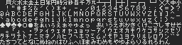 |
| 4a576136	| Japanese font (C-BIOS)			| 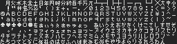 |
| 896e9448	| Japanese font (Nikko PC-70100)	| 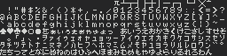 |
| dc17e52f	| Japanese font						| 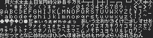 |
| b6a01b07	| International font				| 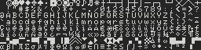 |
| c81e7760	| International font (DIN)			|  |
| cce9bec4	| International font (C-BIOS)		| 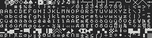 |
| 7ac42370	| Korean font						| 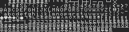 |
| 1b47913e	| Brazilian font					| |
| 68f7ddab	| Brazilian font (HotBit 1.1)		| 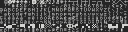 |
| 7421782f	| Brazilian font (Expert 1.1)		| 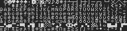 |
| a0571623	| Brazilian font (Expert Turbo)		| |
| ef64e6c7	| Brazilian font (Expert 1.0)		| 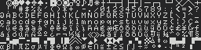 |
| f06e5273	| Brazilian font (C-BIOS)			| 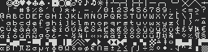 |
| fd9a9b37	| Brazilian font (HotBit 1.2)		| 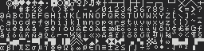 |
| e15baad4	| Danish/Norwegian font				| 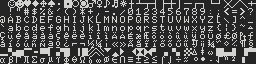 |
| 6a96416f	| Polish font						| 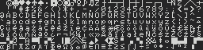 |
| 37c99bb6	| Russian font						| 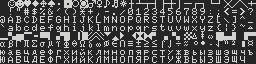 |

## Sony HitBit font references

| Description				| image |
|---------------------------|-------|
| Sony HitBit HB-11			| 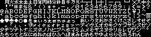 |
| Sony HitBit HB-11			| 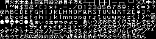 |
| Sony HitBit HB-11			| 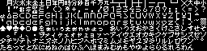 |
| Sony HitBit HB-11			| 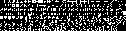 |
| Sony HitBit HB-11			| 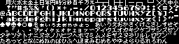 |
| Sony HitBit HB-11			| 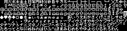 |
| Sony HitBit HB-F1/HB-F1II	| 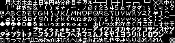 |
| Sony HitBit HB-F1/HB-F1II	| 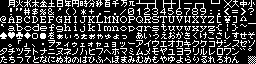 |
| Sony HitBit HB-F900		| 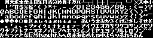 |
| Sony HitBit HB-F900		|  |
| Sony HitBit HB-F900		| 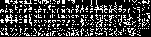 |
